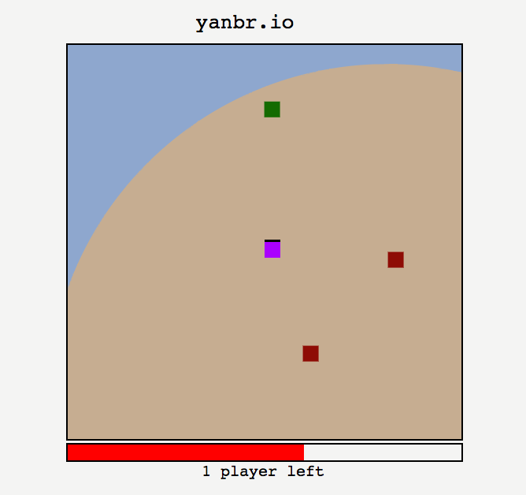

# Yet Another Battle Royale

Making a battle royale game with websockets and HTML5 canvas

## Todo

[X] Center the camera around the player, BR style

[X] Add more physics-y collisions so you can actually affect other players

[X] Make player collisions actually accurate physics (or good enough)

[X] Add entities that injure/kill/heal the player

[X] Add a death view (where the player becomes a killing entity)

[X] Add a death circle that slowly shrinks

[X] Handle all players dying by ending the game & starting a new one

[X] Make the graphics not _totally_ terrible (better colours, health bar, show alive players/hp)

[X] Make the map much larger

[ ] Minimap

[ ] Make the circle shrink at intervals, with a countdown

[ ] Waiting list for ongoing games (death view)

[ ] Add actual sprites for graphics
